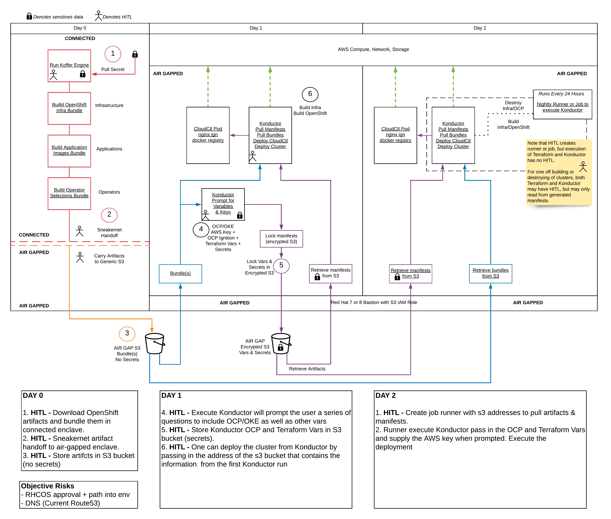

## Why?
When planning and delivering Red Hat OpenShift to deployment environments we typically 
think in terms of installing to standard [Public Cloud] providers such as IBM, Amazon AWS,
and Microsoft Azure. We may also think about private cloud platforms such as VMware,
Red Hat OpenStack, or even bare metal. Delivery within this standard paradigm most often
assumes access to public internet services and dependency resources.

We may choose "[Installer Provisioned Infrastructure]" (IPI) or "[User Provisioned
Infrastructure]" (UPI). The former is an opinionated all-in-one delivery mechanism 
that provisions and configures infrastructure and the platform stack. The latter 
deploys OpenShift, with more flexibility, to a prerequisite user-provided infrastructure 
at the cost of more user responsibility.

Sparta delivers an alternate, opinionated IPI-like OpenShift experience with first
class restricted target environment support, exposed by wrapping the UPI process in an 
ecosystem of UPI delivery tooling.

## How?
Sparta leverages containerized runtimes for executing [Infrastructure as Code] (IaC)
automation plugins and opinionated enforcement of artifact collection and delivery.

The plugin ecosystem is written primarily in [Ansible] and [Terraform], but also features
[BASH], [Python], and [Golang]. This enables community accessibility and advanced capability.

## Method
Airgaped and restricted network deliveries represent similar but critically unique
challenges. Currently, Sparta delivers via an airgap only model, primarily aimed at
pre-existing infrastructure and consisting of four distinct stages.

Stages:
  - [Low-Side] or the public internet access stage.
    1. "Artifact Collection" is the process of collecting and archiving all dependencies for transport
    2. "The Walk" or the disconnected transportation of artifacts through secure boundaries
  - [High-Side] or the network(s) beyond restriction boundaries and or the airgap.
    3. "Manifest Initialization" where declarative configurations are generated and stowed for IaC consumption
    4. "Deployment" or the execution and run of IaC automation as configured by the declarative manifest configuration

[Public Cloud]:https://www.redhat.com/en/topics/cloud-computing/what-is-public-cloud
[Installer Provisioned Infrastructure]:https://github.com/openshift/installer#supported-platforms
[User Provisioned Infrastructure]:https://github.com/openshift/installer#supported-platforms
[IaC]:https://www.ibm.com/cloud/learn/infrastructure-as-code
[Infrastructure as Code]:https://www.ibm.com/cloud/learn/infrastructure-as-code
[Low Side]:https://en.wikipedia.org/wiki/Air_gap_(networking)#Use_in_classified_settings
[High Side]:https://en.wikipedia.org/wiki/Air_gap_(networking)#Use_in_classified_settings
[BASH]:https://www.gnu.org/software/bash
[Python]:https://www.python.org
[Golang]:https://golang.org
[Ansible]:https://www.ansible.com
[Terraform]:https://www.terraform.io

### Architecture Diagram

### [Bundle Creation Demo:](https://asciinema.org/a/BFb4Hq4h9q4tsNllfRT9K5OWC)

{: .fs-6 .fw-300 }
